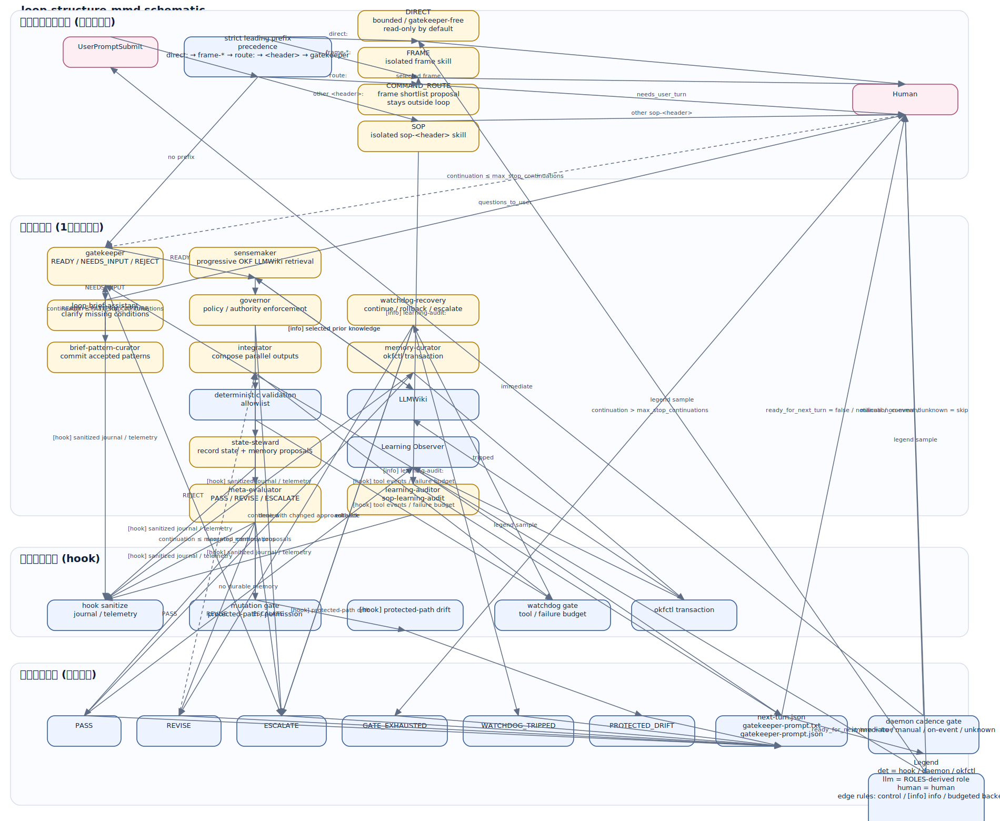

# Loop Engineering Bootstrap

Loop engineering 向けの Codex と Claude Code の基礎的な設定です。

## 設計要約

このパッケージは、制約された人間主導のループを実現するための基本構造です。サイバネティクスと必要多様性に基づき、厳密さが必要な部分は決定論的制御を行います。裁量が有効な部分は LLM の判断に委ねつつ、ループの動作そのものは人間が決定します。ターン横断の学習は OTEL によって出力されます。メモリは OKF スタイルの LLMWiki で管理されます。OTEL によるテレメトリはサニタイズされるため、プロンプト、秘密情報、tool の中身を漏らさずに監査できます。スキル名や実行コマンド名は出力されます。

主な役割は Gatekeeper、Loop Brief Assistant、Sensemaker、Governor、State Steward、Watchdog / Recovery、Meta-Evaluator、Learning Auditor、Memory Curator であり、OKF LLMWiki の永続メモリと、決定論的なターン横断学習の可観測性、およびサニタイズ済み OpenTelemetry ロギングを備えます。

## ループ構造



この SVG により、ループの境界が明示されます。状態、メモリ、人間のポリシー更新が、次のターンを立ち上げる入力になります。

systemd 前提の scheduler daemon も同梱されています。`.agent-loop/bin/next_turn_scheduler_daemon.py` と `.agent-loop/systemd/agent-loop-scheduler.service` があり、`next-turn.json` を監視して scheduler state を記録し、次のターンが準備できたときは設定済みの trigger command を実行できます。各ターンは `gatekeeper-prompt.json` と正規化済み `trigger_cadence`（`immediate` / `manual` / `external-user-prompt` / `on-event:<name>`）も保存するため、次ターンの開始文を機械可読な形で再現できます。Gatekeeper の `validation_commands` は policy の allowlist からのみ実行されます。

## 入口モード

このリポジトリが現在認識するユーザー入力の系統は次のとおりです。

- `direct:` は、Gatekeeper を経由しない bounded な非自律入力です。
- `list:` は、現在の入口モード群と正規ソースを一覧する mode index です。
- `route:` は、Gatekeeper の前に `frame-*` 候補を提案する pre-loop モードです。
- `sop-<header>:` は、先頭 `<header>:` で始まる必須 SOP です。`diag:` や `learning-audit:` が該当します。
- `frame-<name>:` は、人間向けの計画・レビュー・トラブルシュート用 frame です。
- 無接頭辞は、Gatekeeper を起点にする自律ループの入口です。

詳細は `docs/DIRECT_MODE.md`、`docs/SOP_ROUTING.md`、`docs/HUMAN_SKILL_NAMESPACE.md` を参照してください。
フックは先頭が `direct:`、`list:`、`frame-<name>:`、およびその他の `<header>:` のプロンプトを、それぞれ専用モードへ自動ルーティングします。
`route:` の pre-loop 提案モードについては `docs/COMMAND_ROUTING.md` にまとめています。

## 設計思想とアーキテクチャ上の判断

このアーカイブには、運用者だけでなく保守者とレビュー担当者向けの日本語設計文書が 2 つ含まれています。

- `docs/DESIGN_PHILOSOPHY.md`: サイバネティクス、必要多様性、組織学習、Principal-Agent/Common Agency、Goodhart/Campbell、STAMP、センスメイキング、アフォーダンス、創発、組織ルーティン、オートメーションの逆説から役割構造を導出します。また、決定論的制御、LLM の判断、人間の権限の境界も定義します。
- `docs/ARCHITECTURE.md`: 単一のスーパーエージェントモデル、Generator/Evaluator のみの設計、全 LLM 制御、全決定論制御、自動リセットする Watchdog、暗黙的な skill ロード、詳細な OTel、無条件のシンボリックリンク拒否、設定上書き、バックアップのみのインストール、無制限の意味論的マージなど、棄却した代替案とその背景を記録します。

インストーラは両文書を `.agent-loop/docs/` にコピーし、インストール先の各リポジトリ内部でも判断根拠を参照できるようにします。

## Direct モード

`direct:` で始まるプロンプトは、Gatekeeper を経由しない bounded な非自律ターンを開始します。

```text
direct: このテストが flaky な理由を説明して
```

Direct モードは、一回限りの質問、調査、説明を想定しています。Gatekeeper や loop-control roles を呼び出さず、ターン横断学習の観測も生成せず、OKF メモリの昇格も行いません。ただし、破壊的コマンド、保護パス、権限、Watchdog、LLMWiki、テレメトリの各制御は引き続き適用されます。`.agent-loop/direct-policy.json` では、変更はデフォルトで無効です。

詳細は `docs/DIRECT_MODE.md` を参照してください。

## モード一覧

`list:` で始まるプロンプトは `sop-list` を読み込み、現在利用できるユーザー入力モード群とその正規ソースの一覧を返します。

## 必須 SOP ヘッダールーティング

`<header>:` で始まるプロンプトは自律ループをバイパスし、モデルがリクエストを処理する前に対応する `sop-<header>` skill のロードを強制します。

```text
diag: 統合テストが flaky な理由を調査して
```

は `sop-diag` をロードします。フックはプラットフォームネイティブな `SKILL.md` を読み取り、検証し、その完全な内容を developer context として注入し、OTel には skill の identity のみを記録し、skill が欠落または無効ならプロンプトをブロックします。SOP ターンは既定で read-only であり、Gatekeeper や他の loop-control roles は呼び出しません。

詳細は `docs/SOP_ROUTING.md` を参照してください。インストール済みの `sop-diag` の例と `templates/SOP_SKILL_TEMPLATE.md` も含まれています。

## Gatekeeper 優先の受付

ユーザーは Generator や Sensemaker ではなく Gatekeeper に話しかけます。未修飾のプロンプトで、かつ進行中の Assistant 対話に属していないものは、すべてインストール済みの `gatekeeper` role にルーティングされます。Gatekeeper は、明示的な学習契約とメモリ契約を含む 10 項目の運用契約を検証し、`READY`、`NEEDS_INPUT`、`REJECT` のいずれかを返します。

- `READY`: 正規化された `loop-brief.json` を書き込み、Sensemaker に引き渡します。
- `NEEDS_INPUT`: 読み取り専用の Loop Brief Assistant を起動します。Assistant は最小限の質問だけを行い、ユーザーターンをまたいで下書きを保持し、完全な下書きを Gatekeeper に戻して独立に再検証させます。
- `REJECT`: 自律ループは開始されません。

Loop Brief Assistant は Sensemaker に直接渡すことはできず、権限、評価基準、学習ポリシー、メモリポリシー、エスカレーション責任を勝手に作ることもできません。フックは、信頼された Gatekeeper の `READY` レポートが存在するまで、Sensemaker レポートとプロダクト変更を拒否します。詳細は `docs/GATEKEEPER_PROTOCOL.md` と `docs/LOOP_BRIEF_ASSISTANT.md` を参照してください。

## OKF LLMWiki の永続メモリ

リポジトリローカルの `llmwiki/` ディレクトリは Open Knowledge Format v0.1 の bundle です。OKF は vendor-neutral な Markdown/YAML 交換フォーマットと progressive-disclosure な index を提供し、loop-control layer は真実性の規律、権限、昇格、訂正、廃止を提供します。

```text
Sensemaker retrieval
  -> State Steward memory proposal
  -> Meta-Evaluator independent classification
  -> Memory Curator complete OKF documents
  -> deterministic Go okfctl transaction
```

`llmwiki/` へのエージェントによる直接編集は拒否されます。読み取り専用の Memory Curator が承認した提案だけが `.agent-loop/bin/okfctl apply-report` に到達できます。Go の transaction は secret-like な内容と無効な profile document を拒否し、`log.md` を更新し、index を再生成し、bundle 全体を検証し、前の bundle をバックアップしてから atomic に置き換えます。

追加のメモリコマンドは Go で実装されています。付属の shell launcher は Go のみを呼び出し、Python は呼び出しません。

```bash
.agent-loop/bin/build-okfctl.sh
.agent-loop/bin/okfctl validate --root llmwiki
.agent-loop/bin/okfctl search --root llmwiki --query "failure pattern"
.agent-loop/bin/okfctl show --root llmwiki --id failure-patterns/example
```

インストーラは、存在しない LLMWiki の skeleton files だけを作成し、既存の概念は上書きしません。詳細は `docs/OKF_LLMWIKI.md` と `templates/OKF_CONCEPT.md` を参照してください。

## 学習の可観測性

完了したすべての `PASS` loop turn は、内容を最小化した learning observation に変換され、observer はサニタイズ済みの OTEL 学習シグナルを出力しながら、安定した問題シグネチャ、Sensemaker による明示的な過去学習の検索と考慮、State Steward からの構造化された lesson と question の更新、そして lesson の妥当性と再利用結果に関する Meta-Evaluator の判断を追跡します。read-only の loop turn でも contract が許す場合は同じ完了経路に入り、次を構築します。

```text
.agent-loop/state/learning/learning-health.json
.agent-loop/state/learning/learning-index.json
.agent-loop/state/learning/turns/<turn-id>.json
```

主な指標は、observation coverage、knowledge capture、learning reuse、learning-chain completion、first reuse までの時間、役立つ再利用 / 有害な再利用、検証済み学習後の再発、question resolution、evaluation adaptation、古くなった lesson、孤立した lesson、identifier collision、trend delta、OKF メモリ検索 coverage、proposal-to-commit completion、memory commit failure、重み付き learning-debt score です。高い PASS 率や lesson 数の多さだけでは、学習が起きたとは見なしません。

決定論的レポートの再生成や確認には以下を使います。

```bash
python3 .agent-loop/bin/learning_health.py rebuild
python3 .agent-loop/bin/learning_health.py report --format json
python3 .agent-loop/bin/learning_health.py check --fail-on unhealthy
```

独立したターン横断監査は SOP ルータ経由で実行します。

```text
learning-audit: 直近 50 件の完了済み loop turn を監査し、再利用、再発、訂正、適応、learning debt を確認して
```

これにより `sop-learning-audit` が読み込まれ、読み取り専用の `learning-auditor` が呼び出されます。v11 より前の既存履歴は、`.agent-loop/learning-policy.json` の `history_start_at` により health baseline から除外できます。詳細は `docs/LEARNING_OBSERVABILITY.md` を参照してください。

## テレメトリ契約

フックは `agent.loop.*` という名前の OTLP/HTTP JSON event を送信します。記録するのは次の項目だけです。

- platform (`claude` または `codex`)
- role / subagent 名
- 観測可能な場合の呼び出し skill 名
- tool 名
- `git`、`python3`、`npm` などの executable command 名
- host が提供する場合の成功 / 失敗、所要時間、mutation epoch、watchdog state、aggregate な learning-health の件数または比率

raw prompt、command string、command argument、file path、URL、search pattern、tool input、tool output、hook header、environment variable、credential、problem signature、lesson ID、lesson text、question ID、evidence reference は一切送信しません。ローカルの runtime journal も同じサニタイズ契約に従います。

`tool_input_redacted=true` と `tool.identity_redacted=false` は意図的です。raw input は抑制されますが、tool / skill / command の identity は可視のままです。Claude Code の `OTEL_LOG_TOOL_DETAILS=1` を有効にすると、Bash コマンド全体とすべての tool argument が露出するため、このアーカイブでは明示的に無効のままにしています。

## Claude Code

`.claude/settings.json` では、Claude Code ネイティブの OTel を有効にしつつ、prompt、tool-detail、tool-content、raw-body の各 logging は無効にしています。ネイティブ event は一般的な利用状況や tool activity を提供し、カスタムの `agent.loop.*` event は正確な project skill 名と executable command 名を、argument なしで追加します。

hooks は `UserPromptExpansion`、`SubagentStart`、`PreToolUse`、`PostToolUse`、`PostToolUseFailure`、permission event、completion event を対象にします。`/skill-name` の直接呼び出しと、事前の Skill-tool 呼び出しの両方が観測されます。

## Codex

project hooks は、Codex がサポートする hook path に対して同じサニタイズ済みの `agent.loop.*` schema を送出します。対象は Bash、apply_patch / Edit / Write の alias、MCP tool、カスタム subagent lifecycle event です。Codex は現在、WebSearch やよりリッチな unified-exec path のすべてを project hook へ公開しているわけではないため、これは完全な監査ではありません。

Codex は project-local な `.codex/config.toml` にある `[otel]` を無視します。そのため、このアーカイブは独自の project hook OTLP exporter を使います。現時点の native Codex OTel は `codex.tool_result` event に出力スニペットが含まれる可能性があり、field-level の抑制スイッチも文書化されていないため、installer では intentionally 無効にしています。

## インストール

```bash
python3 install.py --repo /path/to/repository
```

ドライラン:

```bash
python3 install.py --repo /path/to/repository --dry-run
```

インストール済み OKF メモリ層の検証:

```bash
.agent-loop/bin/okfctl validate --root llmwiki
```

## Collector

ローカルの debug collector の例は `.agent-loop/otel-collector.yaml` にあります。

```bash
otelcol-contrib --config .agent-loop/otel-collector.yaml
```

デフォルトの hook endpoint は `http://127.0.0.1:4318/v1/logs` です。credentials をコミットせずに上書きするには次を使います。

```bash
export AGENT_LOOP_OTEL_ENDPOINT=https://collector.example/v1/logs
export AGENT_LOOP_OTEL_HEADERS='Authorization=Bearer ...'
export AGENT_LOOP_ENVIRONMENT=production
```

Claude Code は `OTEL_*` 環境変数を hook subprocess に渡さないため、hook exporter は意図的に `AGENT_LOOP_*` prefix を使います。

## Self-test

```bash
python3 .agent-loop/hooks/loop_hook.py telemetry-test --platform claude
python3 .agent-loop/hooks/loop_hook.py telemetry-test --platform codex
```

collector が待ち受けていない場合は、サニタイズ済みの fallback record が `.agent-loop/runtime/telemetry.jsonl` に書き込まれます。self-test には fake な secret argument が含まれており、`git` という command name のみが送出されることを検証します。

## Security boundary

hooks は guardrail であり、完全な sandbox ではありません。OS / container の isolation、IAM、branch protection、required CI checks は維持してください。別途の security review が露出データを受け入れた場合を除き、`OTEL_LOG_TOOL_DETAILS`、`OTEL_LOG_TOOL_CONTENT`、raw API body、user-prompt logging は有効にしないでください。

## Interaction routing examples

```text
direct: リポジトリのアーキテクチャを説明して
  -> direct, Gatekeeper-free, read-only by default

diag: 現在の障害を調査して
  -> mandatory sop-diag

この運用契約の下で CI failure を修復して ...
  -> Gatekeeper
     -> NEEDS_INPUT -> Loop Brief Assistant -> Gatekeeper review
     -> READY -> Sensemaker and autonomous loop
```

## 自律ループの開始

hooks と 10 個の名前付き role は、1 回の execution とそのターン横断学習証跡を統制します。後続の execution を自動的に開始するには、なお scheduler と persistent state が必要です。

利用前に、outcome、discovery scope、authority、evaluation evidence、persistence、learning、durable memory、stop conditions、escalation、trigger cadence を含む安定した運用契約と Loop Brief を定義してください。

- Gatekeeper protocol: `docs/GATEKEEPER_PROTOCOL.md`
- 日本語入力ガイド: `docs/LOOP_INPUT_GUIDE.md`
- 編集可能な Loop Brief: `templates/LOOP_BRIEF.md`

インストーラは `docs/SOP_ROUTING.md` と `templates/SOP_SKILL_TEMPLATE.md` も `.agent-loop/` にコピーします。

## LLM 支援の意味論的インストール

決定論的インストーラは、有効な JSON の hook / settings ファイルと、管理対象の Markdown block をマージします。既存の legacy file、同名の custom skill、file と directory の衝突をどう再解釈するかは推測してはいけません。そのような場合は、Codex または Claude Code 向けの installation dossier を生成します。

```bash
python3 install.py \
  --repo /path/to/repository \
  --conflict agent \
  --agent-plan-dir /safe/path/install-plan
```

これはターゲットリポジトリに変更を加えません。代わりに次を生成します。

```text
INSTALL_AGENT.md
merge-plan.json
source-inventory.json
PROMPT.txt
INSTALL_MERGE_REPORT.md
```

`PROMPT.txt` を coding agent に渡すか、次のプロンプトで agent を起動します。

```text
install: この package を /path/to/repository に install し、既存の configuration をすべて意味論的に merge してください
```

この package には、こうしたルーティング済みワークフロー向けの `sop-install` が含まれています。インストール agent は、実際の既存ファイルを確認し、バックアップを作成し、無関係な挙動を保持し、上書きではなく merge を行い、構造上の blocker を解消し、決定論的 baseline installer を実行し、バックアップから project-specific な内容を意味論的に戻し、最後に次を実行して完了しなければなりません。

```bash
python3 install.py --repo /path/to/repository --validate-only
```

root の `INSTALL_AGENT.md` と `docs/MERGE_RULES.md` が、権威ある手順を定義します。plan と report には、設定内容をログやチャットへコピーしないよう、意図的に hash と path だけが含まれます。
